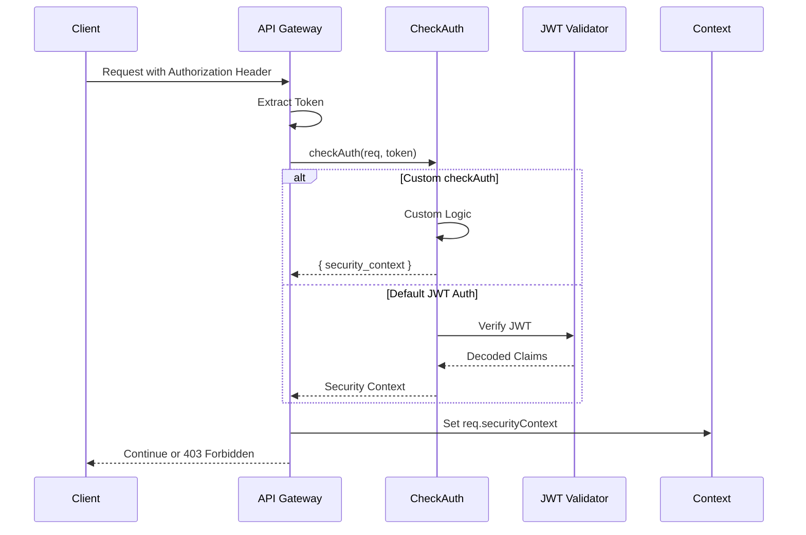

# Cube.js 多租户和权限控制详解

## 目录
1. [多租户架构](#多租户架构)
2. [安全上下文 (Security Context)](#安全上下文-security-context)
3. [认证机制 (Authentication)](#认证机制-authentication)
4. [授权机制 (Authorization)](#授权机制-authorization)
5. [行级安全 (Row-Level Security)](#行级安全-row-level-security)
6. [成员级安全 (Member-Level Security)](#成员级安全-member-level-security)
7. [API Scopes 控制](#api-scopes-控制)
8. [查询重写 (Query Rewrite)](#查询重写-query-rewrite)
9. [实现示例](#实现示例)

---

## 多租户架构

### 核心概念

Cube.js 的多租户架构通过以下几个关键函数实现租户隔离：

#### 1. **contextToAppId**
**位置**: `packages/cubejs-server-core/src/core/types.ts:123`

**作用**: 定义应用级别的隔离

```typescript
export type ContextToAppIdFn = (context: RequestContext) => string | Promise<string>;
```

**实现示例**:
```javascript
// cube.js
module.exports = {
  contextToAppId: ({ securityContext }) => {
    return `CUBE_APP_${securityContext.tenantId}`;
  }
};
```

**效果**:
- 每个租户有独立的编译器缓存 (Compiler Cache)
- Schema 编译结果隔离
- 不同租户的数据模型版本可以不同

#### 2. **contextToOrchestratorId**
**位置**: `packages/cubejs-server-core/src/core/types.ts:126`

**作用**: 定义查询编排器级别的隔离（更细粒度）

```typescript
export type ContextToOrchestratorIdFn = (context: RequestContext) => string | Promise<string>;
```

**实现示例**:
```javascript
// cube.js
module.exports = {
  contextToOrchestratorId: ({ securityContext }) => {
    return `CUBE_${securityContext.tenantId}`;
  }
};
```

**效果**:
- 每个租户有独立的查询编排器实例
- 独立的查询缓存 (Query Cache)
- 独立的查询队列 (Query Queue)
- 独立的预聚合管理
- 独立的数据库连接池

#### 3. **contextToCubeStoreRouterId**
**位置**: `packages/cubejs-server-core/src/core/types.ts:127`

**作用**: CubeStore 路由隔离

```typescript
export type ContextToCubeStoreRouterIdFn = (context: RequestContext) => string | Promise<string>;
```

**效果**: 在 CubeStore 分布式架构中实现租户数据路由隔离

### 多租户隔离层次

```
┌─────────────────────────────────────────┐
│         Application Level               │
│      (contextToAppId)                   │
│  - Compiler Cache                       │
│  - Schema Version                       │
└─────────────────────────────────────────┘
                  ↓
┌─────────────────────────────────────────┐
│      Orchestrator Level                 │
│  (contextToOrchestratorId)              │
│  - Query Orchestrator Instance          │
│  - Query Cache                          │
│  - Query Queue                          │
│  - Database Connection Pool             │
│  - Pre-aggregations                     │
└─────────────────────────────────────────┘
                  ↓
┌─────────────────────────────────────────┐
│      CubeStore Router Level             │
│  (contextToCubeStoreRouterId)           │
│  - Data Routing                         │
│  - Storage Isolation                    │
└─────────────────────────────────────────┘
```

---

## 安全上下文 (Security Context)

### RequestContext 结构

**位置**: `packages/cubejs-server-core/src/core/types.ts:81-86`

```typescript
export interface RequestContext {
  // @deprecated Renamed to securityContext
  authInfo?: any;
  securityContext: any;
  requestId: string;
}
```

### Security Context 内容示例

```javascript
{
  // 租户信息
  tenantId: "tenant_123",

  // 用户信息
  userId: "user_456",
  email: "user@example.com",

  // 角色和权限
  roles: ["admin", "analyst"],
  groups: ["finance", "marketing"],

  // 其他元数据
  department: "sales",
  region: "us-west",

  // JWT Claims
  sub: "user_456",
  iss: "https://auth.example.com",
  exp: 1234567890
}
```

### Security Context 提取

**位置**: `packages/cubejs-api-gateway/src/gateway.ts:1509-1553`

#### 1. **默认提取器** (无 claimsNamespace)
```javascript
protected createSecurityContextExtractor(options?: JWTOptions): SecurityContextExtractorFn {
  return (ctx: Readonly<RequestContext>) => {
    let securityContext: any = {};

    if (typeof ctx.securityContext === 'object' && ctx.securityContext !== null) {
      // 处理遗留的 'u' 属性
      if (ctx.securityContext.u) {
        securityContext = {
          ...ctx.securityContext,
          ...ctx.securityContext.u,
        };
        delete securityContext.u;
      } else {
        securityContext = ctx.securityContext;
      }
    }

    return securityContext;
  };
}
```

#### 2. **使用 claimsNamespace**
```javascript
// cube.js 配置
module.exports = {
  jwt: {
    claimsNamespace: 'https://myapp.com/cube'
  }
};

// JWT payload:
{
  "sub": "user123",
  "https://myapp.com/cube": {
    "tenantId": "tenant_456",
    "roles": ["admin"]
  }
}
```

---

## 认证机制 (Authentication)

### checkAuth 函数

**位置**: `packages/cubejs-api-gateway/src/types/auth.ts`

**类型定义**:
```typescript
type CheckAuthFn = (
  ctx: any,
  authorization?: string
) => Promise<void | CheckAuthResponse> | CheckAuthResponse | void;

type CheckAuthResponse = {
  security_context?: any;
};
```

### 认证流程

**位置**: `packages/cubejs-api-gateway/src/gateway.ts:2379-2406`



### 1. **默认 JWT 认证**

**位置**: `packages/cubejs-api-gateway/src/gateway.ts:2292-2377`

```javascript
protected createDefaultCheckAuth(options?: JWTOptions): PreparedCheckAuthFn {
  const verifyToken = (auth, secret) => jwt.verify(auth, secret, {
    algorithms: options?.algorithms,
    issuer: options?.issuer,
    audience: options?.audience,
    subject: options?.subject,
  });

  return async (req, auth) => {
    if (auth) {
      try {
        req.securityContext = await verifyToken(auth, secret);
      } catch (e) {
        if (this.enforceSecurityChecks) {
          throw new CubejsHandlerError(403, 'Forbidden', 'Invalid token', e);
        }
      }
    } else if (this.enforceSecurityChecks) {
      throw new CubejsHandlerError(403, 'Forbidden', 'Authorization header isn\'t set');
    }

    return { securityContext: req.securityContext };
  };
}
```

**JWT 配置选项**:
```javascript
module.exports = {
  jwt: {
    key: process.env.CUBEJS_API_SECRET,
    algorithms: ['HS256', 'RS256'],
    issuer: 'https://auth.myapp.com',
    audience: 'cube-api',
    subject: 'user',
    claimsNamespace: 'https://myapp.com/cube'
  }
};
```

### 2. **JWK (JSON Web Key) 支持**

**位置**: `packages/cubejs-api-gateway/src/gateway.ts:2304-2354`

```javascript
// 支持从 JWK URL 动态获取公钥
module.exports = {
  jwt: {
    jwkUrl: 'https://auth.myapp.com/.well-known/jwks.json',
    // 或者动态 JWK URL
    jwkUrl: async (decodedToken) => {
      return `https://auth.${decodedToken.tenant}.myapp.com/.well-known/jwks.json`;
    }
  }
};
```

### 3. **自定义认证**

```javascript
module.exports = {
  checkAuth: async (req, authorization) => {
    // 1. API Key 认证
    if (authorization.startsWith('ApiKey ')) {
      const apiKey = authorization.substring(7);
      const user = await validateApiKey(apiKey);
      req.securityContext = {
        userId: user.id,
        tenantId: user.tenantId,
        roles: user.roles
      };
      return;
    }

    // 2. OAuth 2.0 认证
    if (authorization.startsWith('Bearer ')) {
      const token = authorization.substring(7);
      const userInfo = await validateOAuthToken(token);
      req.securityContext = {
        userId: userInfo.sub,
        tenantId: userInfo.tenant,
        roles: userInfo.roles
      };
      return;
    }

    // 3. 自定义 Session 认证
    const sessionId = req.headers['x-session-id'];
    if (sessionId) {
      const session = await getSession(sessionId);
      req.securityContext = session.user;
      return;
    }

    throw new Error('Authentication required');
  }
};
```

### 4. **enforceSecurityChecks**

**位置**: `packages/cubejs-api-gateway/src/gateway.ts:195`

```javascript
this.enforceSecurityChecks = options.enforceSecurityChecks ||
  (process.env.NODE_ENV === 'production');
```

- **生产环境**: 默认强制安全检查
- **开发环境**: 可选安全检查

---

## 授权机制 (Authorization)

### 1. **contextToRoles**

**位置**: `packages/cubejs-server-core/src/core/types.ts:124`

```typescript
export type ContextToRolesFn = (context: RequestContext) => string[] | Promise<string[]>;
```

**实现示例**:
```javascript
module.exports = {
  contextToRoles: async ({ securityContext }) => {
    // 从安全上下文中提取角色
    return securityContext.roles || [];
  }
};
```

### 2. **contextToGroups**

**位置**: `packages/cubejs-server-core/src/core/types.ts:125`

```typescript
export type ContextToGroupsFn = (context: RequestContext) => string[] | Promise<string[]>;
```

**实现示例**:
```javascript
module.exports = {
  contextToGroups: async ({ securityContext }) => {
    // 从安全上下文中提取用户组
    return securityContext.groups || [];
  }
};
```

---

## 行级安全 (Row-Level Security)

### Access Policy 配置

**位置**: `packages/cubejs-testing/birdbox-fixtures/rbac/model/cubes/orders.js`

#### 基本结构

```javascript
cube('orders', {
  sql_table: 'public.orders',

  access_policy: [
    {
      // 角色匹配 (role, group, 或 groups)
      role: 'admin',  // 或 group: 'finance', 或 groups: ['finance', 'sales']

      // 条件判断（可选）
      conditions: [
        {
          if: ({ securityContext }) => securityContext.department === 'sales'
        }
      ],

      // 成员级别访问控制
      memberLevel: {
        includes: ['*'],  // 或具体成员列表 ['orders.count', 'orders.total']
        excludes: ['orders.internal_cost']
      },

      // 行级别访问控制
      rowLevel: {
        // allowAll: true,  // 允许访问所有行
        filters: [
          {
            member: 'orders.tenant_id',
            operator: 'equals',
            values: ({ securityContext }) => [securityContext.tenantId]
          }
        ]
      }
    }
  ]
});
```

### RLS 实现逻辑

**位置**: `packages/cubejs-server-core/src/core/CompilerApi.js:363-494`

#### 1. **应用 RLS 的流程**

```javascript
async applyRowLevelSecurity(query, evaluatedQuery, context) {
  const compilers = await this.getCompilers({ requestId: context.requestId });
  const { cubeEvaluator } = compilers;

  if (!cubeEvaluator.isRbacEnabled()) {
    return { query, denied: false };
  }

  const queryCubes = await this.getCubesFromQuery(evaluatedQuery, context);

  // 分别收集 Cube 和 View 的过滤器
  const cubeFiltersPerCubePerRole = {};
  const viewFiltersPerCubePerRole = {};
  const hasAllowAllForCube = {};

  for (const cubeName of queryCubes) {
    const cube = cubeEvaluator.cubeFromPath(cubeName);
    const filtersMap = cube.isView ? viewFiltersPerCubePerRole : cubeFiltersPerCubePerRole;

    if (cubeEvaluator.isRbacEnabledForCube(cube)) {
      let hasAccessPermission = false;
      const userPolicies = await this.getApplicablePolicies(cube, context, compilers);

      for (const policy of userPolicies) {
        hasAccessPermission = true;

        // 处理行级过滤器
        (policy?.rowLevel?.filters || []).forEach(filter => {
          filtersMap[cubeName] = filtersMap[cubeName] || {};
          const policyKey = policy.role || policy.group || policy.groups || 'default';
          filtersMap[cubeName][policyKey] = filtersMap[cubeName][policyKey] || [];
          filtersMap[cubeName][policyKey].push(
            this.evaluateNestedFilter(filter, cube, context, cubeEvaluator)
          );
        });

        // 处理 allowAll
        if (!policy?.rowLevel || policy?.rowLevel?.allowAll) {
          hasAllowAllForCube[cubeName] = true;
          break;
        }
      }

      if (!hasAccessPermission) {
        // 拒绝访问：添加永假条件
        query.segments = query.segments || [];
        query.segments.push({
          expression: () => '1 = 0',
          cubeName: cube.name,
          name: 'rlsAccessDenied',
        });
        return { query, denied: true };
      }
    }
  }

  const rlsFilter = this.buildFinalRlsFilter(
    cubeFiltersPerCubePerRole,
    viewFiltersPerCubePerRole,
    hasAllowAllForCube
  );

  if (rlsFilter) {
    query.filters = query.filters || [];
    query.filters.push(rlsFilter);
  }

  return { query, denied: false };
}
```

#### 2. **过滤器组合逻辑**

**位置**: `packages/cubejs-server-core/src/core/CompilerApi.js:458-494`

```javascript
buildFinalRlsFilter(cubeFiltersPerCubePerRole, viewFiltersPerCubePerRole, hasAllowAllForCube) {
  // 逻辑:
  // 1. 删除 allowAll 的 cube 的所有过滤器
  // 2. 同一角色/组的过滤器用 AND 连接
  // 3. 不同角色/组的过滤器用 OR 连接
  // 4. Cube 和 View 过滤器用 AND 连接

  return this.removeEmptyFilters({
    and: [{
      or: Object.keys(cubeFiltersPerPolicy).map(policyKey => ({
        and: cubeFiltersPerPolicy[policyKey]
      }))
    }, {
      or: Object.keys(viewFiltersPerPolicy).map(policyKey => ({
        and: viewFiltersPerPolicy[policyKey]
      }))
    }]
  });
}
```

**生成的 SQL WHERE 子句示例**:
```sql
WHERE (
  -- Cube filters (OR across roles, AND within role)
  (
    (orders.tenant_id = 'tenant_123' AND orders.region = 'us-west')  -- Role 1
    OR
    (orders.tenant_id = 'tenant_123' AND orders.status = 'active')   -- Role 2
  )
  AND
  -- View filters
  (
    (users_view.department = 'sales')  -- Role 1 view filter
    OR
    (users_view.department = 'finance') -- Role 2 view filter
  )
)
```

### RLS 过滤器类型

#### 1. **简单过滤器**
```javascript
{
  member: 'orders.tenant_id',
  operator: 'equals',
  values: ({ securityContext }) => [securityContext.tenantId]
}
```

#### 2. **嵌套过滤器 (OR)**
```javascript
{
  or: [
    {
      member: 'orders.user_id',
      operator: 'equals',
      values: ({ securityContext }) => [securityContext.userId]
    },
    {
      member: 'orders.manager_id',
      operator: 'equals',
      values: ({ securityContext }) => [securityContext.userId]
    }
  ]
}
```

#### 3. **嵌套过滤器 (AND)**
```javascript
{
  and: [
    {
      member: 'orders.tenant_id',
      operator: 'equals',
      values: ({ securityContext }) => [securityContext.tenantId]
    },
    {
      member: 'orders.region',
      operator: 'equals',
      values: ({ securityContext }) => [securityContext.region]
    }
  ]
}
```

#### 4. **动态值**
```javascript
{
  member: 'orders.created_at',
  operator: 'inDateRange',
  values: ({ securityContext }) => {
    const days = securityContext.roles.includes('admin') ? 365 : 30;
    return ['last ' + days + ' days'];
  }
}
```

### 支持的操作符

- `equals`
- `notEquals`
- `contains`
- `notContains`
- `startsWith`
- `endsWith`
- `gt` (greater than)
- `gte` (greater than or equal)
- `lt` (less than)
- `lte` (less than or equal)
- `set`
- `notSet`
- `inDateRange`
- `notInDateRange`
- `beforeDate`
- `afterDate`

---

## 成员级安全 (Member-Level Security)

### memberLevel 配置

**位置**: `packages/cubejs-server-core/src/core/CompilerApi.js:549-625`

```javascript
access_policy: [
  {
    role: 'analyst',
    memberLevel: {
      // 方式 1: 显式包含
      includes: [
        'orders.count',
        'orders.total',
        'orders.status',
        'orders.created_at'
      ],

      // 方式 2: 包含所有，排除敏感字段
      includes: ['*'],
      excludes: [
        'orders.cost',
        'orders.internal_notes',
        'orders.profit_margin'
      ]
    }
  }
]
```

### 成员可见性处理

**位置**: `packages/cubejs-server-core/src/core/CompilerApi.js:549-625`

```javascript
async patchVisibilityByAccessPolicy(compilers, context, cubes) {
  const isMemberVisibleInContext = {};
  const { cubeEvaluator } = compilers;

  if (!cubeEvaluator.isRbacEnabled()) {
    return { cubes, visibilityMaskHash: null };
  }

  for (const cube of cubes) {
    const evaluatedCube = cubeEvaluator.cubeFromPath(cube.config.name);
    if (cubeEvaluator.isRbacEnabledForCube(evaluatedCube)) {
      const applicablePolicies = await this.getApplicablePolicies(evaluatedCube, context, compilers);

      const computeMemberVisibility = (item) => {
        for (const policy of applicablePolicies) {
          if (policy.memberLevel) {
            if (policy.memberLevel.includesMembers.includes(item.name) &&
             !policy.memberLevel.excludesMembers.includes(item.name)) {
              return true;
            }
          } else {
            // 无 memberLevel 策略 = 所有成员可见
            return true;
          }
        }
        return false;
      };

      // 应用到 dimensions, measures, segments, hierarchies
      for (const dimension of cube.config.dimensions) {
        isMemberVisibleInContext[dimension.name] = computeMemberVisibility(dimension);
      }
      // ... measures, segments, hierarchies 同理
    }
  }

  // 修改 metaConfig 中的 isVisible 和 public 属性
  return {
    cubes: cubes.map((cube) => ({
      config: {
        ...cube.config,
        measures: cube.config.measures?.map(item => ({
          ...item,
          isVisible: item.isVisible && isMemberVisibleInContext[item.name],
          public: item.public && isMemberVisibleInContext[item.name]
        })),
        // ... dimensions, segments, hierarchies 同理
      },
    })),
    visibilityMaskHash
  };
}
```

### visibilityMaskHash

**作用**: 为不同的成员可见性配置生成唯一的哈希值，用于缓存隔离

**位置**: `packages/cubejs-server-core/src/core/CompilerApi.js:627-632`

```javascript
mixInVisibilityMaskHash(compilerId, visibilityMaskHash) {
  const uuidBytes = uuidParse(compilerId);
  const hashBytes = Buffer.from(visibilityMaskHash, 'hex');
  return uuidv4({
    random: crypto.createHash('sha256')
      .update(uuidBytes)
      .update(hashBytes)
      .digest()
      .subarray(0, 16)
  });
}
```

---

## API Scopes 控制

### contextToApiScopes

**位置**: `packages/cubejs-api-gateway/src/types/auth.ts`

**作用**: 控制用户可以访问哪些 API 端点

```typescript
export type ContextToApiScopesFn = (
  securityContext?: any,
  defaultApiScopes?: ApiScopes[]
) => Promise<ApiScopes[]> | ApiScopes[];

type ApiScopes = 'graphql' | 'meta' | 'data' | 'sql' | 'jobs';
```

### Scope 定义

| Scope | API 端点 | 说明 |
|-------|---------|------|
| `graphql` | `/v1/graphql` | GraphQL API |
| `meta` | `/v1/meta` | 元数据 API (cube 定义) |
| `data` | `/v1/load`, `/v1/subscribe` | 数据查询 API |
| `sql` | `/v1/sql` | SQL API |
| `jobs` | `/v1/pre-aggregations/jobs` | 预聚合任务 API |

### 实现示例

```javascript
module.exports = {
  contextToApiScopes: async (securityContext, defaultApiScopes) => {
    const role = securityContext.role;

    // 管理员：所有权限
    if (role === 'admin') {
      return ['graphql', 'meta', 'data', 'sql', 'jobs'];
    }

    // 分析师：查询和元数据
    if (role === 'analyst') {
      return ['meta', 'data', 'sql'];
    }

    // 只读用户：仅数据查询
    if (role === 'viewer') {
      return ['data'];
    }

    // 默认：无权限
    return [];
  }
};
```

### Scope 验证

**位置**: `packages/cubejs-api-gateway/src/gateway.ts:2461-2478`

```javascript
protected async assertApiScope(
  scope: ApiScopes,
  securityContext?: any,
): Promise<void> {
  const scopes = await this.contextToApiScopesFn(
    securityContext || {},
    getEnv('defaultApiScope') || await this.contextToApiScopesDefFn(),
  );

  const permitted = scopes.indexOf(scope) >= 0;
  if (!permitted) {
    throw new CubejsHandlerError(
      403,
      'Forbidden',
      `API scope is missing: ${scope}`
    );
  }
}
```

### 默认 Scope

```javascript
// 位置: packages/cubejs-api-gateway/src/gateway.ts:158-159
public readonly contextToApiScopesDefFn: ContextToApiScopesFn =
  async () => ['graphql', 'meta', 'data', 'sql'];
```

**环境变量覆盖**:
```bash
CUBEJS_DEFAULT_API_SCOPES=meta,data
```

---

## 查询重写 (Query Rewrite)

### queryRewrite 函数

**位置**: `packages/cubejs-api-gateway/src/types/request.ts`

**作用**: 在查询执行前修改查询，实现动态过滤、参数注入等

```typescript
export type QueryRewriteFn = (
  query: Query,
  context: RequestContext
) => Promise<Query> | Query;
```

### 查询重写流程

**位置**: `packages/cubejs-api-gateway/src/gateway.ts:1248-1282`

```javascript
protected async getNormalizedQueries(
  inputQuery: Record<string, any> | Record<string, any>[],
  context: RequestContext,
  persistent = false,
  memberExpressions: boolean = false,
): Promise<[QueryType, NormalizedQuery[], NormalizedQuery[]]> {
  // 1. 解析查询
  let query = this.parseQueryParam(inputQuery);

  // 2. 规范化查询
  const normalizedQueries = queries.map(q => normalizeQuery(q, persistent));

  // 3. 应用行级安全 (RLS)
  const { query: queryWithRlsFilters, denied } = await compilerApi.applyRowLevelSecurity(
    normalizedQuery,
    evaluatedQuery,
    context
  );

  // 4. 应用用户自定义的 queryRewrite
  let rewrittenQuery = !denied ? await this.queryRewrite(
    queryWithRlsFilters,
    context
  ) : queryWithRlsFilters;

  return [queryType, normalizedQueries, originalQueries];
}
```

### 实现示例

#### 1. **添加租户过滤**
```javascript
module.exports = {
  queryRewrite: (query, { securityContext }) => {
    // 在所有查询中添加租户过滤
    query.filters = query.filters || [];
    query.filters.push({
      member: 'orders.tenant_id',
      operator: 'equals',
      values: [securityContext.tenantId]
    });

    return query;
  }
};
```

#### 2. **动态时间范围**
```javascript
module.exports = {
  queryRewrite: (query, { securityContext }) => {
    const role = securityContext.role;

    // 非管理员只能查看最近 30 天
    if (role !== 'admin') {
      query.timeDimensions = query.timeDimensions || [];

      const hasTimeFilter = query.timeDimensions.some(td => td.dateRange);

      if (!hasTimeFilter) {
        query.timeDimensions.push({
          dimension: 'orders.created_at',
          dateRange: 'last 30 days'
        });
      }
    }

    return query;
  }
};
```

#### 3. **限制查询措施**
```javascript
module.exports = {
  queryRewrite: (query, { securityContext }) => {
    const allowedMeasures = {
      'analyst': ['orders.count', 'orders.total'],
      'viewer': ['orders.count']
    }[securityContext.role] || [];

    // 过滤掉不允许的 measures
    if (query.measures) {
      query.measures = query.measures.filter(m =>
        allowedMeasures.includes(m)
      );
    }

    return query;
  }
};
```

#### 4. **数据脱敏**
```javascript
module.exports = {
  queryRewrite: (query, { securityContext }) => {
    if (securityContext.role !== 'admin') {
      // 移除敏感维度
      if (query.dimensions) {
        query.dimensions = query.dimensions.filter(d =>
          !['users.email', 'users.phone', 'users.ssn'].includes(d)
        );
      }
    }

    return query;
  }
};
```

### queryRewrite vs Row-Level Security

| 特性 | queryRewrite | Row-Level Security (RLS) |
|------|--------------|--------------------------|
| 应用时机 | 查询规范化后 | queryRewrite 之前 |
| 配置位置 | `cube.js` | `access_policy` in schema |
| 灵活性 | 高 (完全自定义) | 中 (结构化配置) |
| 可维护性 | 低 (集中式代码) | 高 (声明式配置) |
| 性能 | 需要手动优化 | 自动优化 |
| 推荐用途 | 复杂业务逻辑 | 标准的行级过滤 |

**最佳实践**: 优先使用 RLS，复杂场景使用 queryRewrite

---

## 实现示例

### 示例 1: SaaS 多租户应用

```javascript
// cube.js
module.exports = {
  // JWT 认证
  jwt: {
    key: process.env.CUBEJS_API_SECRET,
    claimsNamespace: 'https://myapp.com/cube'
  },

  // 租户隔离
  contextToOrchestratorId: ({ securityContext }) => {
    return `TENANT_${securityContext.tenantId}`;
  },

  // 角色提取
  contextToRoles: ({ securityContext }) => {
    return securityContext.roles || [];
  },

  // 查询重写
  queryRewrite: (query, { securityContext }) => {
    // 自动添加租户过滤
    if (!securityContext.tenantId) {
      throw new Error('Tenant ID is required');
    }

    return query;
  }
};
```

```javascript
// schema/orders.js
cube('orders', {
  sql_table: 'orders',

  access_policy: [
    {
      role: '*',  // 所有用户
      rowLevel: {
        filters: [
          {
            member: 'orders.tenant_id',
            operator: 'equals',
            values: ({ securityContext }) => [securityContext.tenantId]
          }
        ]
      }
    },
    {
      role: 'manager',
      rowLevel: {
        filters: [
          {
            member: 'orders.tenant_id',
            operator: 'equals',
            values: ({ securityContext }) => [securityContext.tenantId]
          },
          {
            or: [
              {
                member: 'orders.assigned_to',
                operator: 'equals',
                values: ({ securityContext }) => [securityContext.userId]
              },
              {
                member: 'orders.department',
                operator: 'equals',
                values: ({ securityContext }) => [securityContext.department]
              }
            ]
          }
        ]
      }
    }
  ],

  dimensions: {
    id: { sql: 'id', type: 'number', primary_key: true },
    tenant_id: { sql: 'tenant_id', type: 'string' },
    assigned_to: { sql: 'assigned_to', type: 'string' },
    department: { sql: 'department', type: 'string' },
    status: { sql: 'status', type: 'string' }
  },

  measures: {
    count: { type: 'count' },
    total: { sql: 'amount', type: 'sum' }
  }
});
```

### 示例 2: 企业级权限控制

```javascript
// cube.js
module.exports = {
  // 自定义认证
  checkAuth: async (req, authorization) => {
    // 从 API Gateway 或 SSO 获取用户信息
    const userInfo = await fetchUserFromAuthService(authorization);

    req.securityContext = {
      userId: userInfo.id,
      email: userInfo.email,
      roles: userInfo.roles,
      department: userInfo.department,
      region: userInfo.region,
      dataAccessLevel: userInfo.dataAccessLevel
    };
  },

  // 组提取
  contextToGroups: ({ securityContext }) => {
    return [
      securityContext.department,
      `region_${securityContext.region}`,
      `level_${securityContext.dataAccessLevel}`
    ];
  },

  // API Scope 控制
  contextToApiScopes: ({ securityContext }) => {
    const scopes = [];

    if (securityContext.roles.includes('admin')) {
      return ['graphql', 'meta', 'data', 'sql', 'jobs'];
    }

    if (securityContext.roles.includes('analyst')) {
      scopes.push('meta', 'data', 'sql');
    }

    if (securityContext.roles.includes('viewer')) {
      scopes.push('data');
    }

    return scopes;
  }
};
```

```javascript
// schema/sales.js
cube('sales', {
  sql_table: 'sales',

  access_policy: [
    {
      // 使用 groups 而不是 role
      groups: ['region_us_west', 'region_us_east'],
      conditions: [
        {
          if: ({ securityContext }) =>
            securityContext.dataAccessLevel >= 3
        }
      ],
      memberLevel: {
        includes: ['*'],
        excludes: ['sales.cost', 'sales.margin']
      },
      rowLevel: {
        filters: [
          {
            member: 'sales.region',
            operator: 'equals',
            values: ({ securityContext }) => [securityContext.region]
          }
        ]
      }
    },
    {
      role: 'finance',
      memberLevel: {
        includes: ['*']  // 财务可以看到所有字段
      },
      rowLevel: {
        allowAll: true  // 财务可以看到所有行
      }
    },
    {
      role: 'sales_rep',
      memberLevel: {
        includes: ['*'],
        excludes: ['sales.cost', 'sales.margin', 'sales.commission']
      },
      rowLevel: {
        filters: [
          {
            member: 'sales.sales_rep_id',
            operator: 'equals',
            values: ({ securityContext }) => [securityContext.userId]
          }
        ]
      }
    }
  ],

  dimensions: {
    id: { sql: 'id', type: 'number', primary_key: true },
    region: { sql: 'region', type: 'string' },
    sales_rep_id: { sql: 'sales_rep_id', type: 'string' }
  },

  measures: {
    count: { type: 'count' },
    revenue: { sql: 'revenue', type: 'sum' },
    cost: { sql: 'cost', type: 'sum' },
    margin: {
      sql: 'revenue - cost',
      type: 'number'
    }
  }
});
```

### 示例 3: 动态数据源路由

```javascript
// cube.js
module.exports = {
  // 基于租户的数据源路由
  driverFactory: async ({ dataSource, securityContext }) => {
    if (dataSource === 'default') {
      // 根据租户路由到不同数据库
      const tenantId = securityContext?.tenantId;

      if (!tenantId) {
        throw new Error('Tenant ID is required');
      }

      // 查询租户的数据库配置
      const dbConfig = await getTenantDbConfig(tenantId);

      return new PostgresDriver({
        host: dbConfig.host,
        database: dbConfig.database,
        user: dbConfig.user,
        password: dbConfig.password,
        port: dbConfig.port
      });
    }

    // 其他数据源...
  },

  // 预聚合 Schema 隔离
  preAggregationsSchema: ({ securityContext }) => {
    return `pre_agg_${securityContext.tenantId}`;
  }
};
```

---

## 安全最佳实践

### 1. **最小权限原则**
```javascript
access_policy: [
  {
    role: 'analyst',
    memberLevel: {
      includes: [
        'orders.count',
        'orders.total',
        'orders.status'
      ]
      // 不要使用 includes: ['*'] 除非必要
    }
  }
]
```

### 2. **默认拒绝**
```javascript
// 没有匹配的 access_policy = 拒绝访问
// 总是从最严格的策略开始
access_policy: [
  {
    role: '*',  // 默认策略
    memberLevel: {
      includes: []  // 默认无权限
    },
    rowLevel: {
      filters: [
        {
          expression: () => '1 = 0'  // 默认拒绝所有行
        }
      ]
    }
  },
  {
    role: 'admin',
    memberLevel: {
      includes: ['*']
    },
    rowLevel: {
      allowAll: true
    }
  }
]
```

### 3. **敏感信息保护**
```javascript
// 使用 excludes 明确排除敏感字段
memberLevel: {
  includes: ['*'],
  excludes: [
    'users.ssn',
    'users.credit_card',
    'users.password_hash'
  ]
}
```

### 4. **审计日志**
```javascript
module.exports = {
  extendContext: async (req) => {
    // 记录访问日志
    await auditLog.record({
      userId: req.securityContext?.userId,
      action: 'query',
      path: req.path,
      timestamp: new Date()
    });

    return {};
  }
};
```

### 5. **生产环境强制安全**
```javascript
// 确保生产环境启用安全检查
module.exports = {
  jwt: {
    key: process.env.CUBEJS_API_SECRET,
    algorithms: ['RS256'],  // 使用非对称加密
    issuer: 'https://auth.myapp.com',
    audience: 'cube-api'
  },

  // 生产环境自动启用
  // enforceSecurityChecks: process.env.NODE_ENV === 'production'
};
```

---

## 参考文档位置

- **类型定义**: `packages/cubejs-server-core/src/core/types.ts`
- **认证实现**: `packages/cubejs-api-gateway/src/gateway.ts`
- **RLS 实现**: `packages/cubejs-server-core/src/core/CompilerApi.js`
- **测试示例**: `packages/cubejs-testing/birdbox-fixtures/rbac/`
- **Schema 编译器**: `packages/cubejs-schema-compiler/src/compiler/`

---

## 总结

Cube.js 提供了完善的多租户和权限控制体系：

1. **多租户隔离**:
   - `contextToAppId`: 应用级隔离
   - `contextToOrchestratorId`: 查询编排器级隔离
   - `contextToCubeStoreRouterId`: 存储路由隔离

2. **认证机制**:
   - JWT (对称/非对称)
   - JWK 动态密钥
   - 自定义 `checkAuth`

3. **授权机制**:
   - 基于角色 (Role-Based)
   - 基于组 (Group-Based)
   - 行级安全 (Row-Level Security)
   - 成员级安全 (Member-Level Security)
   - API Scope 控制

4. **查询重写**:
   - 动态过滤注入
   - 参数转换
   - 业务逻辑封装

这些机制可以组合使用，构建企业级的数据安全和访问控制系统。
