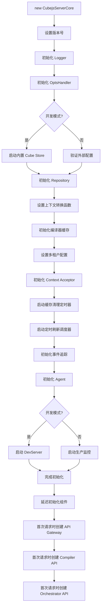

# CubejsServerCore 初始化流程详解

## 概述

`CubejsServerCore` 是 Cube.js 的核心服务类，负责协调所有组件的初始化和运行。本文档详细分析其初始化流程。

**文件位置**: `packages/cubejs-server-core/src/core/server.ts`

## 构造函数签名

```typescript
public constructor(
  opts: CreateOptions = {},
  protected readonly systemOptions?: SystemOptions,
)
```

### 参数说明

| 参数 | 类型 | 必填 | 描述 |
|------|------|------|------|
| `opts` | `CreateOptions` | 否 | 用户配置选项（默认 `{}`） |
| `systemOptions` | `SystemOptions` | 否 | 系统内部选项 |

## 初始化流程概览

```
构造函数调用
    ↓
1. 设置版本号
    ↓
2. 初始化 Logger
    ↓
3. 初始化 OptsHandler（配置处理器）
    ↓
4. 初始化 Repository（数据模型仓库）
    ↓
5. 设置上下文转换函数
    ↓
6. 初始化编译器缓存
    ↓
7. 设置多租户相关配置
    ↓
8. 初始化 Context Acceptor
    ↓
9. 设置 Orchestrator ID 转换
    ↓
10. 启动编译器缓存清理定时器
    ↓
11. 启动定时刷新调度器
    ↓
12. 初始化事件追踪系统
    ↓
13. 初始化 Agent（如果配置）
    ↓
14. 启动开发服务器（如果是开发模式）
    ↓
15. 发送启动事件
```

## 详细初始化步骤

### 步骤 1: 设置版本号

**代码**: `server.ts:182`

```typescript
this.coreServerVersion = version;
```

- 从 `package.json` 读取版本号
- 用于遥测和日志记录

### 步骤 2: 初始化 Logger

**代码**: `server.ts:184-188`

```typescript
this.logger = opts.logger || (
  process.env.NODE_ENV !== 'production'
    ? devLogger(process.env.CUBEJS_LOG_LEVEL)
    : prodLogger(process.env.CUBEJS_LOG_LEVEL)
);
```

**行为**:
- 优先使用用户提供的 `opts.logger`
- 否则根据 `NODE_ENV` 选择：
  - 开发环境 → `devLogger`（更详细的日志）
  - 生产环境 → `prodLogger`（简化的日志）
- 日志级别由 `CUBEJS_LOG_LEVEL` 控制

### 步骤 3: 初始化 OptsHandler

**代码**: `server.ts:190-191`

```typescript
this.optsHandler = new OptsHandler(this, opts, systemOptions);
this.options = this.optsHandler.getCoreInitializedOptions();
```

**OptsHandler 职责**:
1. 验证配置选项
2. 处理配置默认值
3. 初始化 `externalDbType` 和 `cacheAndQueueDriver`
4. 设置驱动工厂
5. 在开发模式下启动内置 Cube Store

**关键处理**:
```typescript
// OptsHandler.ts:363-367
const externalDbType =
  opts.externalDbType ||
  process.env.CUBEJS_EXT_DB_TYPE ||
  (getEnv('devMode') || definedExtDBVariables.length > 0) && 'cubestore' ||
  undefined;
```

### 步骤 4: 初始化 Repository

**代码**: `server.ts:193-194`

```typescript
this.repository = new FileRepository(this.options.schemaPath);
this.repositoryFactory = this.options.repositoryFactory || (() => this.repository);
```

**行为**:
- 创建文件仓库，默认路径为 `model/`（或 `CUBEJS_SCHEMA_PATH` 环境变量）
- 如果提供了 `repositoryFactory`，则使用自定义工厂（多租户场景）
- Repository 负责加载和管理数据模型文件

### 步骤 5: 设置上下文转换函数

**代码**: `server.ts:196-200`

```typescript
this.contextToDbType = this.options.dbType;
this.contextToExternalDbType = wrapToFnIfNeeded(this.options.externalDbType);
this.preAggregationsSchema = wrapToFnIfNeeded(this.options.preAggregationsSchema);
this.orchestratorOptions = wrapToFnIfNeeded(this.options.orchestratorOptions);
this.scheduledRefreshTimeZones = wrapToFnIfNeeded(this.options.scheduledRefreshTimeZones || []);
```

**`wrapToFnIfNeeded` 辅助函数**:
```typescript
function wrapToFnIfNeeded<T, R>(possibleFn: T | ((a: R) => T)): (a: R) => T {
  if (typeof possibleFn === 'function') {
    return <any>possibleFn;
  }
  return () => possibleFn;
}
```

**作用**: 将静态值或函数统一转换为函数形式，方便后续调用。

### 步骤 6: 初始化编译器缓存

**代码**: `server.ts:202-208`

```typescript
this.compilerCache = new LRUCache<string, CompilerApi>({
  max: this.options.compilerCacheSize || 250,
  ttl: this.options.maxCompilerCacheKeepAlive,
  updateAgeOnGet: this.options.updateCompilerCacheKeepAlive,
  // 清理时释放资源
  dispose: (v) => v.dispose(),
});
```

**配置说明**:
- `max`: 最大缓存数量（默认 250）
- `ttl`: 缓存过期时间
- `updateAgeOnGet`: 访问时是否更新过期时间
- `dispose`: 缓存条目被移除时的清理回调

**用途**: 缓存已编译的数据模型，避免重复编译。

### 步骤 7: 设置多租户配置

**代码**: `server.ts:210-222`

```typescript
if (this.options.contextToAppId) {
  this.contextToAppId = this.options.contextToAppId;
  this.standalone = false;  // 多租户模式
}

// ...

this.contextToOrchestratorId = this.options.contextToOrchestratorId || (() => 'STANDALONE');
this.contextToCubeStoreRouterId = this.options.contextToCubeStoreRouterId;
```

**关键概念**:
- `contextToAppId`: 将请求上下文映射到应用 ID（用于多租户）
- `standalone`: 是否为独立模式（单租户）
- `contextToOrchestratorId`: 确定查询编排器实例的 ID
- `contextToCubeStoreRouterId`: Cube Store 路由器 ID

**默认值**:
```typescript
protected readonly contextToAppId: ContextToAppIdFn =
  () => process.env.CUBEJS_APP || 'STANDALONE';

this.contextToOrchestratorId =
  this.options.contextToOrchestratorId || (() => 'STANDALONE');
```

### 步骤 8: 初始化 Context Acceptor

**代码**: `server.ts:215`

```typescript
this.contextAcceptor = this.createContextAcceptor();
```

**默认实现**: `server.ts:347-349`

```typescript
protected createContextAcceptor(): ContextAcceptor {
  return new AcceptAllAcceptor();
}
```

**AcceptAllAcceptor**: `server.ts:82-94`

```typescript
class AcceptAllAcceptor implements ContextAcceptor {
  public async shouldAccept(): Promise<ContextAcceptanceResult> {
    return { accepted: true };
  }

  public async shouldAcceptHttp(): Promise<ContextAcceptanceResultHttp> {
    return { accepted: true };
  }

  public async shouldAcceptWs(): Promise<ContextAcceptanceResultWs> {
    return { accepted: true };
  }
}
```

**用途**:
- 控制请求是否被接受处理
- 可在子类中重写以实现自定义的请求过滤逻辑
- 支持 HTTP 和 WebSocket 两种协议

### 步骤 9: 废弃配置检查

**代码**: `server.ts:217-219`

```typescript
if (this.options.contextToDataSourceId) {
  throw new Error('contextToDataSourceId has been deprecated and removed. Use contextToOrchestratorId instead.');
}
```

### 步骤 10: 启动编译器缓存清理定时器

**代码**: `server.ts:225-230`

```typescript
if (this.options.maxCompilerCacheKeepAlive) {
  this.maxCompilerCacheKeep = setInterval(
    () => this.compilerCache.purgeStale(),
    this.options.maxCompilerCacheKeepAlive
  );
}
```

**作用**: 定期清理过期的编译器缓存，释放内存。

### 步骤 11: 启动定时刷新调度器

**代码**: `server.ts:232`

```typescript
this.startScheduledRefreshTimer();
```

**详细实现**: `server.ts:358-385`

```typescript
public startScheduledRefreshTimer(): [boolean, string | null] {
  // 1. 检查是否准备好处理查询
  if (!this.isReadyForQueryProcessing()) {
    return [false, 'Instance is not ready for query processing, refresh scheduler is disabled'];
  }

  // 2. 避免重复启动
  if (this.scheduledRefreshTimerInterval) {
    return [true, null];
  }

  // 3. 检查是否配置了定时刷新
  if (this.optsHandler.configuredForScheduledRefresh()) {
    const scheduledRefreshTimer = this.optsHandler.getScheduledRefreshInterval();

    // 4. 创建可取消的定时器
    this.scheduledRefreshTimerInterval = createCancelableInterval(
      () => this.handleScheduledRefreshInterval({}),
      {
        interval: scheduledRefreshTimer,
        onDuplicatedExecution: (intervalId) => this.logger('Refresh Scheduler Interval', {
          warning: `Previous interval #${intervalId} was not finished with ${scheduledRefreshTimer} interval`
        }),
        onDuplicatedStateResolved: (intervalId, elapsed) => this.logger('Refresh Scheduler Long Execution', {
          warning: `Interval #${intervalId} finished after ${formatDuration(elapsed)}. Please consider reducing total number of partitions by using rollup_lambda pre-aggregations.`
        })
      }
    );

    return [true, null];
  }

  return [false, 'Instance configured without scheduler refresh timer, refresh scheduler is disabled'];
}
```

**条件判断**:
1. 实例是否准备好（配置了数据库等）
2. 是否已经启动过
3. 是否配置了定时刷新（`CUBEJS_REFRESH_WORKER=true`）

### 步骤 12: 初始化事件追踪系统

**代码**: `server.ts:234-265`

```typescript
this.event = async (event, props: LoggerFnParams) => {
  // 1. 检查是否启用遥测
  if (!this.options.telemetry) {
    return;
  }

  // 2. 生成项目指纹（首次）
  if (!this.projectFingerprint) {
    try {
      this.projectFingerprint = crypto.createHash('md5')
        .update(JSON.stringify(fs.readJsonSync('package.json')))
        .digest('hex');
    } catch (e) {
      internalExceptions(e as Error);
    }
  }

  // 3. 发送追踪数据
  const internalExceptionsEnv = getEnv('internalExceptions');
  try {
    await track({
      timestamp: new Date().toJSON(),
      event,
      projectFingerprint: this.projectFingerprint,
      coreServerVersion: this.coreServerVersion,
      dockerVersion: getEnv('dockerImageVersion'),
      isDocker: isDocker(),
      internalExceptions: internalExceptionsEnv !== 'false' ? internalExceptionsEnv : undefined,
      ...props
    });
  } catch (e) {
    internalExceptions(e as Error);
  }
};
```

**追踪的事件**:
- 服务器启动
- 首次启动
- 查询请求
- 错误信息
- 等等

### 步骤 13: 初始化 Agent

**代码**: `server.ts:267`

```typescript
this.initAgent();
```

**详细实现**: `server.ts:403-425`

```typescript
protected initAgent() {
  const agentEndpointUrl = getEnv('agentEndpointUrl');
  if (agentEndpointUrl) {
    const oldLogger = this.logger;
    this.preAgentLogger = oldLogger;

    // 包装 logger，将日志发送到 Agent 端点
    this.logger = (msg, params) => {
      params.timestamp = params.timestamp || new Date().toJSON();

      oldLogger(msg, params);
      agentCollect(
        { msg, ...params },
        agentEndpointUrl,
        oldLogger
      );
    };
  }
}
```

**作用**: 如果配置了 `CUBEJS_AGENT_ENDPOINT_URL`，所有日志都会发送到该端点（用于监控和分析）。

### 步骤 14: 开发模式特殊处理

**代码**: `server.ts:269-344`

#### A. 发送首次启动事件

```typescript
if (this.options.devServer && !this.isReadyForQueryProcessing()) {
  this.event('first_server_start');
}
```

#### B. 启动开发服务器

```typescript
if (this.options.devServer) {
  this.devServer = new DevServer(this, {
    dockerVersion: getEnv('dockerImageVersion'),
    externalDbTypeFn: this.contextToExternalDbType,
    isReadyForQueryProcessing: this.isReadyForQueryProcessing.bind(this)
  });

  // ... 包装 logger 以追踪特定事件
}
```

#### C. 包装 Logger（开发模式）

```typescript
const oldLogger = this.logger;
this.logger = ((msg, params) => {
  if (
    msg === 'Load Request' ||
    msg === 'Load Request Success' ||
    msg === 'Orchestrator error' ||
    msg === 'Internal Server Error' ||
    // ... 更多事件
  ) {
    const props = {
      error: params.error,
      ...(params.apiType ? { apiType: params.apiType } : {}),
      ...(params.protocol ? { protocol: params.protocol } : {}),
      ...(params.appName ? { appName: params.appName } : {}),
      ...(params.sanitizedQuery ? { query: params.sanitizedQuery } : {}),
    };

    this.event(msg, props);
  }
  oldLogger(msg, params);
});
```

#### D. 注册异常处理器

```typescript
if (!process.env.CI) {
  process.on('uncaughtException', this.onUncaughtException);
}
```

### 步骤 15: 生产模式处理

**代码**: `server.ts:308-344`

```typescript
else {
  const oldLogger = this.logger;
  let loadRequestCount = 0;
  let loadSqlRequestCount = 0;

  // 1. 包装 logger 统计请求数
  this.logger = ((msg, params) => {
    if (msg === 'Load Request Success') {
      if (params.apiType === 'sql') {
        loadSqlRequestCount++;
      } else {
        loadRequestCount++;
      }
    } else if (msg === 'Cube SQL Error') {
      const props = {
        error: params.error,
        apiType: params.apiType,
        protocol: params.protocol,
        ...(params.appName ? { appName: params.appName } : {}),
        ...(params.sanitizedQuery ? { query: params.sanitizedQuery } : {}),
      };
      this.event(msg, props);
    }
    oldLogger(msg, params);
  });

  // 2. 定期发送聚合统计
  if (this.options.telemetry) {
    setInterval(() => {
      if (loadRequestCount > 0 || loadSqlRequestCount > 0) {
        this.event('Load Request Success Aggregated', {
          loadRequestSuccessCount: loadRequestCount,
          loadSqlRequestSuccessCount: loadSqlRequestCount
        });
      }
      loadRequestCount = 0;
      loadSqlRequestCount = 0;
    }, 60000);  // 每分钟
  }

  // 3. 发送启动事件
  this.event('Server Start');
}
```

## 关键组件的延迟初始化

有些组件不在构造函数中初始化，而是在首次使用时才创建：

### 1. API Gateway

**首次调用**: `this.apiGateway()`

```typescript
protected apiGateway(): ApiGateway {
  if (this.apiGatewayInstance) {
    return this.apiGatewayInstance;
  }

  return (this.apiGatewayInstance = this.createApiGatewayInstance(
    this.options.apiSecret,
    this.getCompilerApi.bind(this),
    this.getOrchestratorApi.bind(this),
    this.logger,
    { /* ... 配置 */ }
  ));
}
```

### 2. Compiler API

**首次调用**: `await this.getCompilerApi(context)`

```typescript
public async getCompilerApi(context: RequestContext) {
  const appId = await this.contextToAppId(context);
  let compilerApi = this.compilerCache.get(appId);

  if (!compilerApi) {
    compilerApi = this.createCompilerApi(
      this.repositoryFactory(context),
      { /* ... 配置 */ }
    );
    this.compilerCache.set(appId, compilerApi);
  }

  return compilerApi;
}
```

**缓存策略**:
- 以 `appId` 为键缓存
- 支持多租户，每个租户独立编译器实例
- 使用 LRU 缓存策略

### 3. Orchestrator API

**首次调用**: `await this.getOrchestratorApi(context)`

```typescript
public async getOrchestratorApi(context: RequestContext): Promise<OrchestratorApi> {
  const orchestratorId = await this.contextToOrchestratorId(context);

  if (this.orchestratorStorage.has(orchestratorId)) {
    return this.orchestratorStorage.get(orchestratorId);
  }

  // 创建数据源驱动工厂
  const driverPromise: Record<string, Promise<BaseDriver>> = {};

  const orchestratorApi = this.createOrchestratorApi(
    async (dataSource = 'default') => {
      if (driverPromise[dataSource]) {
        return driverPromise[dataSource];
      }

      return driverPromise[dataSource] = (async () => {
        const driver = await this.resolveDriver({ ...context, dataSource }, orchestratorOptions);
        if (driver.setLogger) {
          driver.setLogger(this.logger);
        }
        await driver.testConnection();
        return driver;
      })();
    },
    {
      externalDriverFactory: this.options.externalDriverFactory && (() => { /* ... */ }),
      contextToDbType: async (dataSource) => contextToDbType({ ...context, dataSource }),
      contextToExternalDbType: () => externalDbType,
      redisPrefix: orchestratorId,
      skipExternalCacheAndQueue: externalDbType === 'cubestore',
      cacheAndQueueDriver: this.options.cacheAndQueueDriver,
      ...orchestratorOptions,
    }
  );

  this.orchestratorStorage.set(orchestratorId, orchestratorApi);
  return orchestratorApi;
}
```

**关键点**:
- 以 `orchestratorId` 为键缓存
- 每个 Orchestrator 管理一组数据库连接
- 驱动程序按需懒加载
- 自动测试连接

## 初始化流程图



## 初始化时间线

| 阶段 | 时机 | 组件 |
|------|------|------|
| **即时初始化** | 构造函数中 | Logger, OptsHandler, Repository, 缓存, 定时器 |
| **条件初始化** | 构造函数中 | DevServer（开发模式）, Agent（配置时）, 内置 Cube Store（开发模式） |
| **延迟初始化** | 首次调用时 | API Gateway, Compiler API, Orchestrator API |
| **按需初始化** | 查询时 | 数据库驱动, 外部驱动 |

## 环境变量影响

以下环境变量会影响初始化行为：

### 核心配置
```bash
NODE_ENV=production                     # 影响 logger 类型和默认值
CUBEJS_DEV_MODE=true                   # 启用开发模式
CUBEJS_LOG_LEVEL=trace                 # 日志级别
```

### Cube Store 相关
```bash
CUBEJS_EXT_DB_TYPE=cubestore           # 外部数据库类型
CUBEJS_CUBESTORE_HOST=localhost        # Cube Store 主机
CUBEJS_CUBESTORE_PORT=3030             # Cube Store 端口
CUBEJS_CACHE_AND_QUEUE_DRIVER=cubestore # 缓存和队列驱动
```

### 定时刷新
```bash
CUBEJS_REFRESH_WORKER=true             # 启用定时刷新
CUBEJS_SCHEDULED_REFRESH_TIMER=30      # 刷新间隔（秒）
CUBEJS_SCHEDULED_REFRESH_CONCURRENCY=4 # 并发数
```

### 遥测和监控
```bash
CUBEJS_TELEMETRY=false                 # 禁用遥测
CUBEJS_AGENT_ENDPOINT_URL=http://...   # Agent 端点
```

### 数据模型
```bash
CUBEJS_SCHEMA_PATH=model               # 数据模型路径
```

## 初始化失败场景

### 1. 配置验证失败

```typescript
// OptsHandler.ts:73-86
private assertOptions(opts: CreateOptions) {
  if (
    !this.isDevMode() &&
    !process.env.CUBEJS_DB_TYPE &&
    !opts.dbType &&
    !opts.driverFactory
  ) {
    throw new Error(
      'Either CUBEJS_DB_TYPE, CreateOptions.dbType or CreateOptions.driverFactory ' +
      'must be specified'
    );
  }
}
```

**错误**: 生产环境未指定数据库类型

### 2. Cube Store 启动失败

```typescript
// OptsHandler.ts:440-449
if (cubeStorePackage.isCubeStoreSupported()) {
  // ... 启动 Cube Store
} else {
  this.core.logger('Cube Store is not supported on your system', {
    warning: `You are using ${process.platform} platform with ${process.arch} architecture`
  });
}
```

**警告**: 系统不支持 Cube Store（如某些 ARM 架构）

### 3. 废弃配置使用

```typescript
if (this.options.contextToDataSourceId) {
  throw new Error('contextToDataSourceId has been deprecated and removed. Use contextToOrchestratorId instead.');
}
```

**错误**: 使用已废弃的配置选项

## 最佳实践

### 1. 最小化配置

```typescript
const server = new CubejsServerCore({
  // 必需配置
});
```

**适用于**: 开发环境，会自动启动 Cube Store

### 2. 完整生产配置

```typescript
const server = new CubejsServerCore({
  // 数据库配置
  dbType: 'postgres',

  // 外部存储
  externalDbType: 'cubestore',
  cacheAndQueueDriver: 'cubestore',

  // 多租户
  contextToAppId: ({ securityContext }) => securityContext.tenantId,
  contextToOrchestratorId: ({ securityContext }) => securityContext.tenantId,

  // 认证
  checkAuth: async (req, authorization) => { /* ... */ },

  // 数据模型
  repositoryFactory: ({ securityContext }) => {
    return new FileRepository(`model/${securityContext.tenantId}`);
  },

  // 性能优化
  compilerCacheSize: 500,
  maxCompilerCacheKeepAlive: 3600000,

  // 定时刷新
  scheduledRefreshTimer: true,
  scheduledRefreshConcurrency: 4,

  // 日志
  logger: customLogger,
});
```

### 3. 多租户配置

```typescript
const server = new CubejsServerCore({
  contextToAppId: async ({ securityContext }) => {
    return `tenant_${securityContext.tenantId}`;
  },

  contextToOrchestratorId: async ({ securityContext }) => {
    return `orchestrator_${securityContext.tenantId}`;
  },

  repositoryFactory: ({ securityContext }) => {
    return new FileRepository(`model/${securityContext.tenantId}`);
  },

  // 每个租户独立的数据库连接
  driverFactory: async ({ securityContext, dataSource }) => {
    return {
      type: 'postgres',
      host: getTenantDbHost(securityContext.tenantId),
      // ... 其他配置
    };
  },
});
```

## 生命周期管理

### 启动后操作

```typescript
const server = new CubejsServerCore({ /* ... */ });

// Express 集成
await server.initApp(app);

// WebSocket 支持
const subscriptionServer = server.initSubscriptionServer(sendMessage);

// SQL API
const sqlServer = server.initSQLServer();
```

### 优雅关闭

```typescript
// 1. 停止接受新请求
await server.beforeShutdown();

// 2. 等待现有请求完成
await new Promise(resolve => setTimeout(resolve, 5000));

// 3. 释放所有资源
await server.shutdown();
```

**`beforeShutdown`** (`server.ts:886-894`):
```typescript
public async beforeShutdown() {
  // 停止编译器缓存清理定时器
  if (this.maxCompilerCacheKeep) {
    clearInterval(this.maxCompilerCacheKeep);
  }

  // 停止定时刷新调度器
  if (this.scheduledRefreshTimerInterval) {
    await this.scheduledRefreshTimerInterval.cancel(true);
  }
}
```

**`shutdown`** (`server.ts:923-937`):
```typescript
public async shutdown() {
  // 清理编译器缓存
  this.compilerCache.clear();

  // 移除异常处理器
  if (this.devServer) {
    if (!process.env.CI) {
      process.removeListener('uncaughtException', this.onUncaughtException);
    }
  }

  // 释放 API Gateway
  if (this.apiGatewayInstance) {
    this.apiGatewayInstance.release();
  }

  // 释放所有数据库连接
  return this.orchestratorStorage.releaseConnections();
}
```

## 总结

### 初始化特点

1. **分阶段**: 核心组件即时初始化，辅助组件延迟初始化
2. **条件性**: 根据配置和环境动态调整初始化行为
3. **智能化**: 自动处理默认值和依赖关系
4. **可扩展**: 支持自定义工厂和回调函数

### 关键设计模式

1. **工厂模式**: `driverFactory`, `repositoryFactory`, `externalDriverFactory`
2. **单例模式**: `apiGatewayInstance`, 延迟初始化的组件
3. **缓存模式**: `compilerCache`, `orchestratorStorage`
4. **策略模式**: `contextToAppId`, `contextToOrchestratorId`
5. **装饰器模式**: Logger 的多层包装

### 性能考虑

1. **延迟加载**: API Gateway, Compiler, Orchestrator 按需创建
2. **缓存复用**: 编译器结果、数据库连接缓存
3. **资源池**: 数据库连接池管理
4. **定期清理**: 过期缓存自动清理

---

*文档生成时间: 2025-10-31*
*基于 Cube.js 版本: v1.5.0*
*分析文件: packages/cubejs-server-core/src/core/server.ts*
