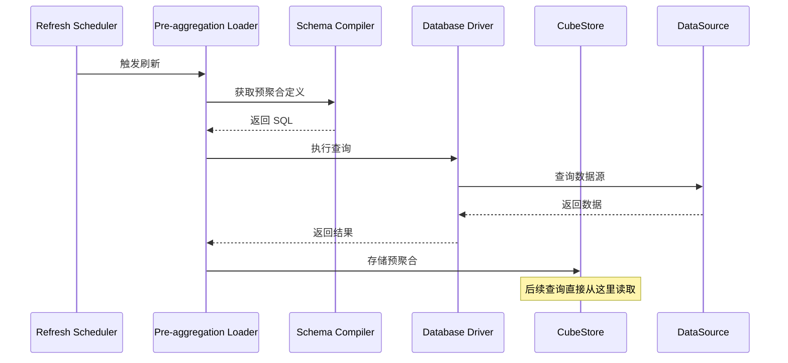
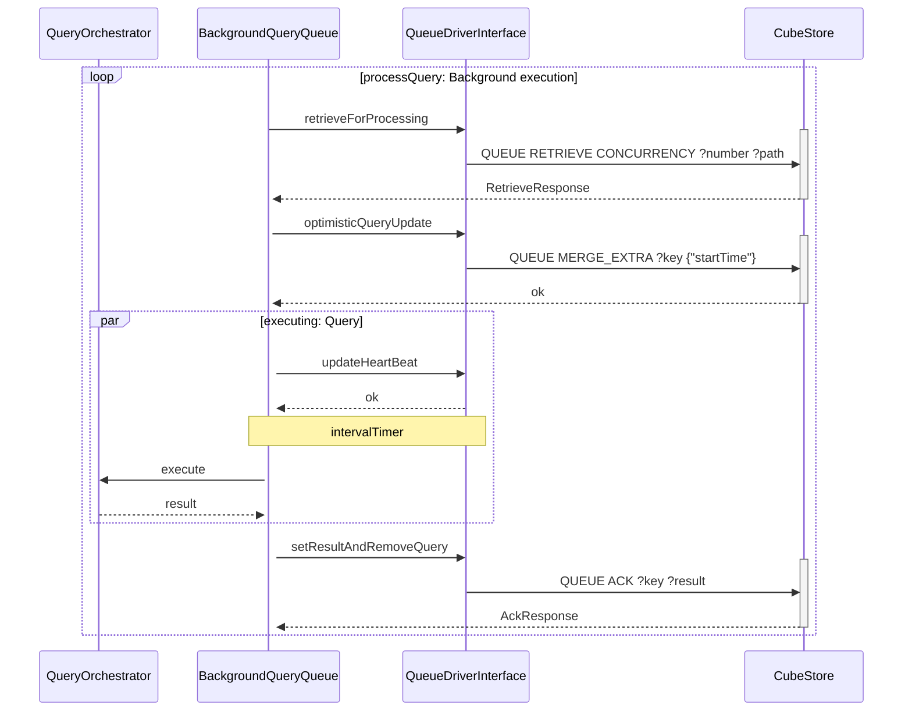

# Cube.js 整体架构详解

## 架构概览

Cube.js 是一个**语义层(Semantic Layer)**，作为现代云数据平台的 OLAP 引擎。它代表了 OLAP 技术在云时代的演进，帮助数据工程师和应用开发者访问现代数据存储中的数据，将其组织成一致的定义，并交付给每个应用。

## 核心设计理念

Cube.js 解决了现代数据基础设施的四大挑战：

1. **分析建模和多维性**: 为云数据平台带来 OLAP 风格的分析能力
2. **性能优化**: 通过智能缓存和预聚合策略显著提升查询响应时间
3. **访问控制和治理**: 提供跨所有消费应用的强大访问控制
4. **API 灵活性**: 提供 REST、GraphQL、SQL 以及传统 MDX/DAX 接口

## 1. 核心组件层

### Server Core (服务器核心)
**位置**: `packages/cubejs-server-core`

**作用**: 整个系统的核心协调器，负责将所有组件连接在一起

**主要职责**:
- 初始化和管理所有子组件 (`CubejsServerCore` 类)
- 处理请求上下文 (Request Context) 和多租户支持
- 驱动工厂 (Driver Factory) 管理
- 调度定时刷新任务 (`RefreshScheduler`)
- 编译器缓存管理 (LRU Cache)
- 事件追踪和遥测

**关键类**:
- `CubejsServerCore`: 主服务器类
- `RefreshScheduler`: 刷新调度器
- `OrchestratorStorage`: 编排器存储管理
- `DevServer`: 开发服务器

### Schema Compiler (Schema 编译器)
**位置**: `packages/cubejs-schema-compiler`

**作用**: 将 Cube 数据模型定义编译成可执行的 SQL 查询，作为分析的 ORM

**主要职责**:
- 解析 `.js` 或 `.yml` 格式的数据模型定义
- 生成针对不同数据库的 SQL 方言
- 处理度量 (Measures)、维度 (Dimensions)、关联 (Joins) 等
- 支持多数据源 (Multi-datasource)
- 支持从简单计数到群组留存和漏斗分析的建模

**核心概念**:
- Cubes: 数据模型定义
- Measures: 聚合指标
- Dimensions: 分析维度
- Joins: 表关联关系

### Query Orchestrator (查询编排器)
**位置**: `packages/cubejs-query-orchestrator`

**作用**: 多阶段查询引擎，管理查询执行、缓存和预聚合

**主要职责**:
- 查询队列管理 (`QueryQueue`)
- 查询结果缓存 (`QueryCache`)
- 预聚合 (Pre-aggregations) 构建和加载
- 后台查询处理
- 心跳管理和查询超时控制

**核心组件**:
- `QueryOrchestrator`: 主编排类，协调查询执行和管理驱动
- `QueryCache`: 查询结果缓存，支持可配置的缓存驱动
- `QueryQueue`: 查询队列和后台处理管理
- `PreAggregations`: 预聚合构建和加载管理
- `DriverFactory`: 创建和管理数据库驱动实例

**缓存和队列驱动架构**:
- **Memory**: 内存缓存和队列（开发环境）
- **CubeStore**: 分布式存储引擎（生产环境）

**驱动选择逻辑**:
1. 显式配置 (`cacheAndQueueDriver` 选项)
2. 环境变量 (`CUBEJS_CACHE_AND_QUEUE_DRIVER`)
3. 自动检测: CubeStore (生产)、Memory (开发)

### API Gateway (API 网关)
**位置**: `packages/cubejs-api-gateway`

**作用**: 提供对外的 API 接口层，保证分析查询结果交付的幂等性

**主要职责**:
- REST API 接口
- GraphQL API 接口
- WebSocket 支持 (实时更新)
- 认证和授权
- 查询重写 (Query Rewrite)
- 长轮询 (Long Polling) 支持，容忍连接问题

## 2. 数据访问层

### Database Drivers (数据库驱动)
**位置**: `packages/cubejs-*-driver`

**作用**: 连接各种数据源

**驱动结构**:
- 基础驱动: `@cubejs-backend/base-driver`
- 所有驱动继承 `BaseDriver` 类
- 通常只需实现 `query()` 和 `testConnection()` 方法
- 支持连接池 (`generic-pool`)
- 需要实现 `release()` 方法以优雅关闭连接

**支持的数据源类型**:
- **云数据仓库**: Snowflake, BigQuery, Redshift
- **查询引擎**: Presto, Athena, Trino
- **传统数据库**: PostgreSQL, MySQL, SQL Server
- **其他**: ClickHouse, MongoDB, Elasticsearch 等

**SQL 方言实现**:
- 基于 `@cubejs-backend/schema-compiler/adapter` 中的 `BaseQuery` 实现
- 每个驱动可以通过 `static dialectClass()` 方法返回自定义的 SQL 方言类
- 驱动包会依赖 `@cubejs-backend/schema-compiler`

## 3. 存储和缓存层 (Rust 组件)

### CubeStore (分布式存储引擎)
**位置**: `rust/cubestore`

**技术栈**: Rust + RocksDB + Apache Parquet + Arrow

**作用**: 专门为预聚合设计的物化 OLAP 缓存存储

**主要特性**:
- 高基数数据支持 (10亿+ 行)
- HyperLogLog 支持 (近似去重计数)
- 分布式架构 (Router + Workers)
- Parquet 列式存储
- 查询下推优化

**架构模块** (位于 `cubestore/src/`):
- `metastore/`: 元数据管理、表模式、分区和分布式协调
- `queryplanner/`: 查询规划、优化和物理执行计划（使用 DataFusion）
- `store/`: 核心存储层，包括压缩和数据管理
- `cluster/`: 分布式集群管理、工作池和节点间通信
- `table/`: 表数据处理、Parquet 集成和数据重分布
- `cachestore/`: 缓存层，包括驱逐策略和队列管理
- `sql/`: SQL 解析和执行层
- `streaming/`: Kafka 流支持
- `remotefs/`: 云存储集成 (S3, GCS, MinIO)
- `config/`: 依赖注入和配置管理

**关键依赖**:
- **DataFusion**: Apache Arrow 查询引擎（使用 Cube 的 fork）
- **Apache Arrow/Parquet**: 列式数据格式和处理
- **RocksDB**: 嵌入式键值存储用于元数据
- **Tokio**: 异步运行时

### CubeSQL (SQL 代理服务器)
**位置**: `rust/cubesql`

**作用**: PostgreSQL 协议兼容的 SQL 接口

**主要特性**:
- 模拟 PostgreSQL 协议 (`pg_catalog` 系统目录)
- 支持 BI 工具直接连接 (Tableau, PowerBI, Metabase 等)
- SQL 查询重写和优化（基于 egg e-graph 库）
- DataFusion 查询执行引擎

**Workspace 结构**:
- `cubesql`: 主 SQL 代理服务器
- `cubeclient`: Cube.js API 通信的 Rust 客户端库
- `pg-srv`: PostgreSQL 协议服务器实现

**查询处理流程**:
1. **协议层**: 接受 PostgreSQL 协议连接
2. **SQL 解析器**: 使用修改的 sqlparser-rs 解析 SQL
3. **查询重写器**: 基于 egg 的重写引擎转换 SQL 为 Cube.js 查询
4. **编译**: 生成 Cube.js REST API 调用或 DataFusion 执行计划
5. **执行**: DataFusion 执行查询或代理到 Cube.js
6. **结果格式化**: 转换结果回协议格式

## 4. 客户端层

### Client Libraries (客户端库)
**位置**: `packages/cubejs-client-*`

**支持的框架**:
- `cubejs-client-core`: 核心 JavaScript 客户端
- `cubejs-client-react`: React 集成
- `cubejs-client-vue`: Vue.js 集成
- `cubejs-client-vue3`: Vue 3 集成
- `cubejs-client-ngx`: Angular 集成

**构建工具**:
- 使用 Rollup 打包客户端库
- 生成 CommonJS 和 UMD 模块
- 支持 `yarn link` 本地开发链接

## 数据流和组件交互

### 查询执行流程

```
用户请求
   ↓
API Gateway (认证/授权)
   ↓
Server Core (请求协调)
   ↓
Schema Compiler (编译数据模型)
   ↓
Query Orchestrator (查询编排)
   ├─→ Query Cache (检查缓存)
   ├─→ Query Queue (队列管理)
   └─→ Pre-aggregations (预聚合处理)
       ↓
Database Driver (执行查询)
   ↓
数据源 (Snowflake/BigQuery/等)
   ↓
CubeStore (存储预聚合结果)
   ↓
返回结果给用户
```

### 预聚合 (Pre-aggregation) 流程



### 队列处理流程（与 CubeStore 交互）

参考 `packages/cubejs-query-orchestrator/DEVELOPMENT.md`：



## 关键设计特点

### 1. 多租户支持
- 通过 `contextToOrchestratorId` 实现租户隔离
- 支持 `contextToAppId` 进行应用级别隔离
- 每个租户可以有独立的数据源和配置

### 2. 缓存和队列系统
- **2 种后端支持**: Memory(default)、CubeStore
- **自动驱动选择**: 根据环境和配置自动选择最佳驱动
- **查询去重**: 相同查询只执行一次，其他请求等待结果

### 3. 分布式架构
- **CubeStore 分布式模式**: Router 节点 + Worker 节点
- **水平扩展**: 支持添加更多 Worker 节点
- **RPC 通信**: 节点间通过自定义 RPC 协议通信

### 4. SQL 方言支持
- 针对不同数据库生成优化的 SQL
- 支持数据库特定函数和语法
- 可扩展的方言系统

### 5. 实时和批处理
- **实时查询**: 直接查询数据源
- **预聚合批处理**: 定时刷新预聚合表
- **混合模式**: 支持部分数据实时 + 部分预聚合

### 6. TypeScript 增量编译
- 使用 TypeScript 项目引用 (Project References)
- 增量编译缓存可能导致问题，使用 `yarn clean` 清理
- 支持 watch 模式开发

## 部署模式

### 1. 开发模式
- 内置 CubeStore (从 v0.26.48 开始)
- Developer Playground UI
- 热重载支持
- 详细的日志输出
- 环境变量: `CUBEJS_DEV_MODE=true`

### 2. 生产模式
- 独立部署 CubeStore 集群
- 水平扩展支持
- 高可用配置
- 生产级日志
- 性能监控和遥测

### 3. Cube Cloud
- 全托管服务
- 自动扩展
- 企业级功能
- 管理基础设施

### 4. Docker 部署
```bash
# 单容器部署
docker run -p 4000:4000 -p 15432:15432 \
  -v ${PWD}:/cube/conf \
  -e CUBEJS_DEV_MODE=true \
  cubejs/cube

# CubeStore 独立部署
docker run -d -p 3030:3030 cubejs/cubestore:edge
```

## 开发工作流

### Monorepo 结构
- 使用 Yarn Workspaces + Lerna 管理包
- TypeScript 编译跨包协调
- 每个包有独立的 Jest 配置

### 常用命令
```bash
# 安装依赖
yarn install

# 构建所有包
yarn build

# TypeScript 编译
yarn tsc
yarn tsc:watch  # Watch 模式

# 测试
yarn test                          # 所有测试
cd packages/[package-name] && yarn test  # 单个包

# 代码检查
yarn lint
yarn lint:fix

# 清理构建产物
yarn clean
```

### 驱动开发
1. 复制现有驱动包结构（如 `@cubejs-backend/mysql-driver`）
2. 命名格式: `@cubejs-backend/<db-name>-driver`
3. 实现 `query()` 和 `testConnection()` 方法
4. 如需自定义 SQL，继承 `BaseQuery` 并实现 `static dialectClass()`
5. 添加到 `cubejs-server-core/core/DriverDependencies.js`

### Rust 组件开发
```bash
# CubeStore
cd rust/cubestore
cargo build
cargo test
cargo fmt

# CubeSQL
cd rust/cubesql
cargo build
cargo test --bin cubesqld
```

## 测试策略

### 单元测试
- 大多数包在 `/test` 目录有 Jest 测试
- TypeScript 包使用 `jest.config.js` 配置
- SQL 编译和查询规划使用快照测试

### 集成测试
- 驱动集成测试: `packages/cubejs-testing-drivers`
- 端到端测试: `packages/cubejs-testing`
- 基于 Docker 的数据库驱动测试环境

### Rust 测试
- 单元测试使用 `#[cfg(test)]` 模块
- 集成测试在 `/tests` 目录
- CubeSQL 使用 `cargo-insta` 进行快照测试

## 性能优化特性

### 1. 预聚合 (Pre-aggregations)
- **Rollup**: 基本聚合表
- **Original SQL**: 基于原始 SQL 的预聚合
- **Lambda**: 动态分区预聚合
- **时间分区**: 按时间范围分区
- **增量刷新**: 只刷新新数据

### 2. 缓存层次
- **查询缓存**: 缓存查询结果
- **Schema 缓存**: 缓存编译后的 Schema
- **预聚合缓存**: CubeStore 物化存储

### 3. 查询优化
- **查询重写**: 自动将查询路由到预聚合
- **分区裁剪**: 只扫描需要的分区
- **列式存储**: Parquet 格式高效读取
- **向量化执行**: Arrow 向量化计算

## 核心技术栈总结

### TypeScript/JavaScript 组件
- **Node.js 20+**: 运行时环境
- **TypeScript**: 主要开发语言
- **Jest**: 测试框架
- **Lerna**: Monorepo 管理
- **Rollup**: 客户端打包

### Rust 组件
- **Rust nightly-2025-08-01**: 编译器版本
- **Tokio**: 异步运行时
- **DataFusion**: 查询执行引擎
- **Arrow/Parquet**: 数据格式
- **RocksDB**: 元数据存储
- **sqlparser-rs**: SQL 解析
- **egg**: 查询重写优化

### 数据库和存储
- **多种数据源驱动**: 支持 20+ 数据库
- **CubeStore**: 自研分布式存储

## 架构优势

通过这个架构设计，Cube.js 能够:

✅ **提供亚秒级查询延迟**: 通过预聚合和多层缓存
✅ **支持高并发请求**: 队列管理和连接池
✅ **处理大规模数据集**: CubeStore 分布式架构
✅ **保持数据一致性和安全性**: 统一的访问控制层
✅ **支持多种数据源和客户端**: 可扩展的驱动和 API 系统
✅ **云原生架构**: 容器化部署，水平扩展
✅ **开发者友好**: 丰富的客户端库和开发工具

## 参考资料

- **代码仓库**: `packages/cubejs-server-core`, `packages/cubejs-query-orchestrator`, `packages/cubejs-schema-compiler`
- **Rust 组件**: `rust/cubestore`, `rust/cubesql`
- **架构文档**: `packages/cubejs-query-orchestrator/DEVELOPMENT.md`
- **贡献指南**: `CONTRIBUTING.md`
- **官方文档**: https://cube.dev/docs

---

*本文档基于 Cube.js 源代码分析生成，版本基于 master 分支 (commit: 69b2cb302)*
